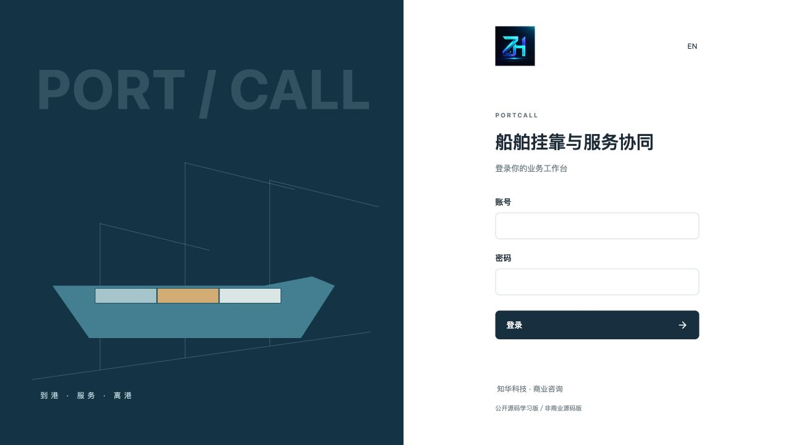
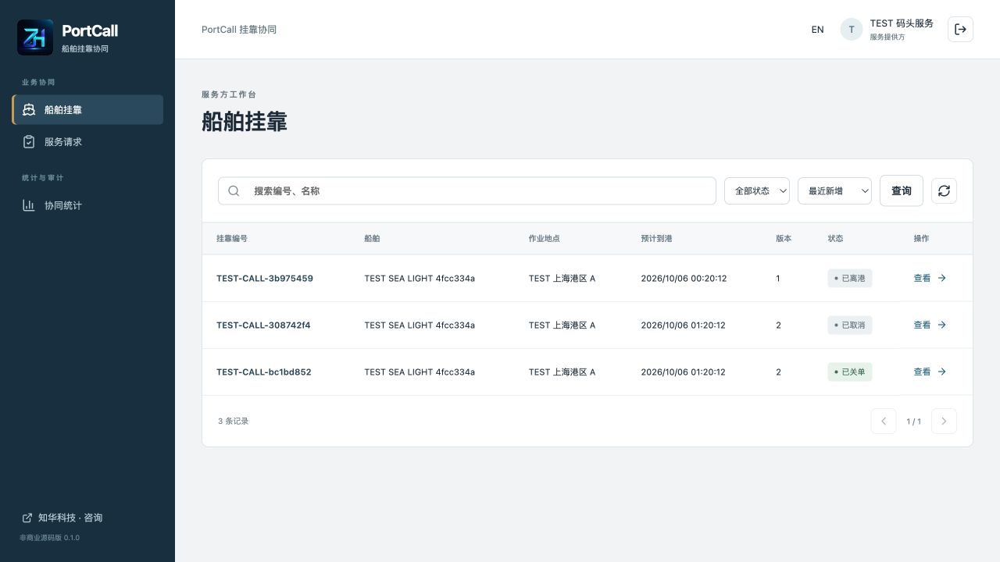
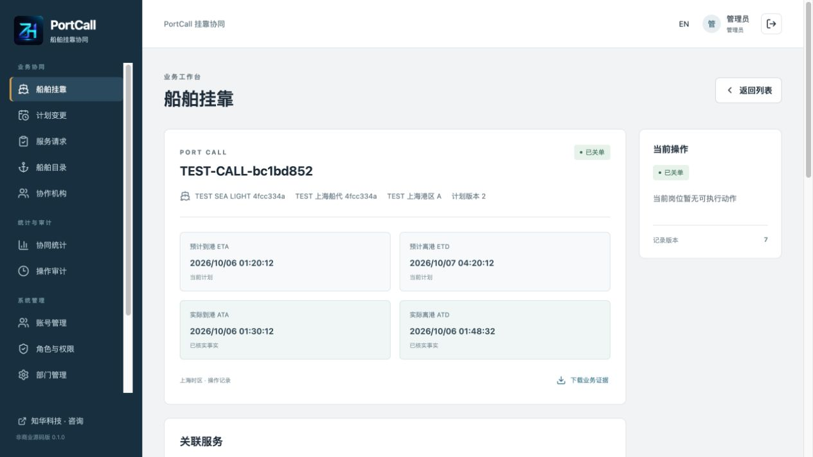
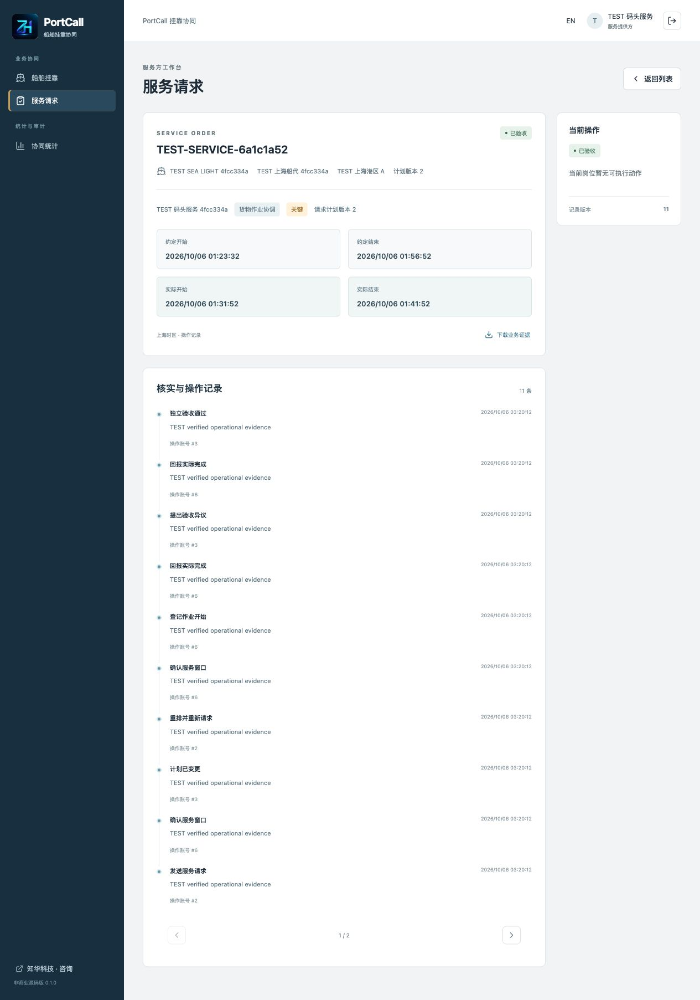
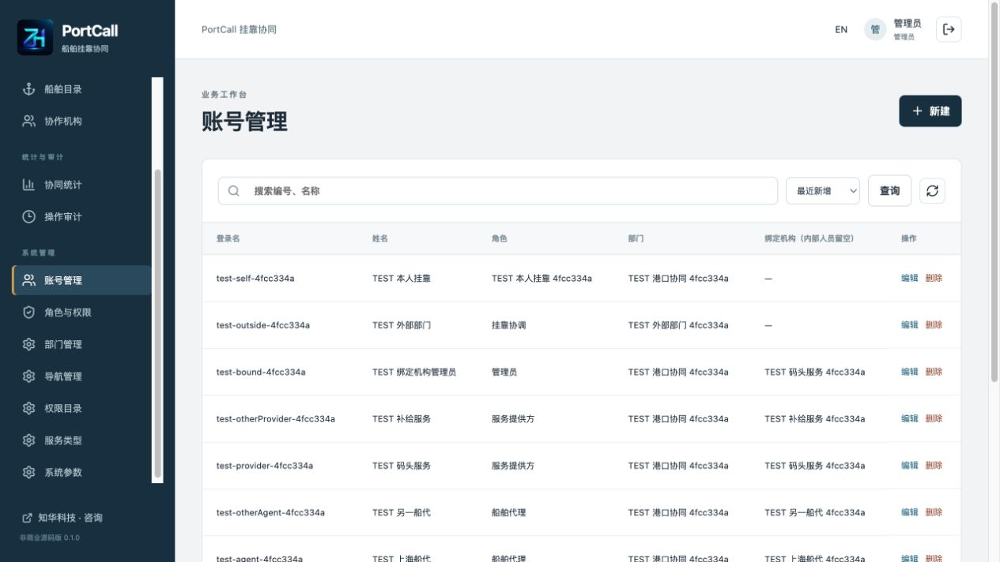
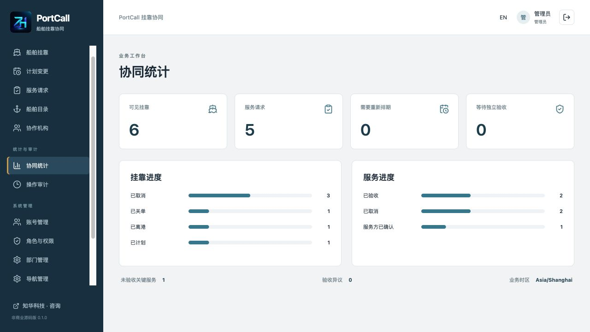
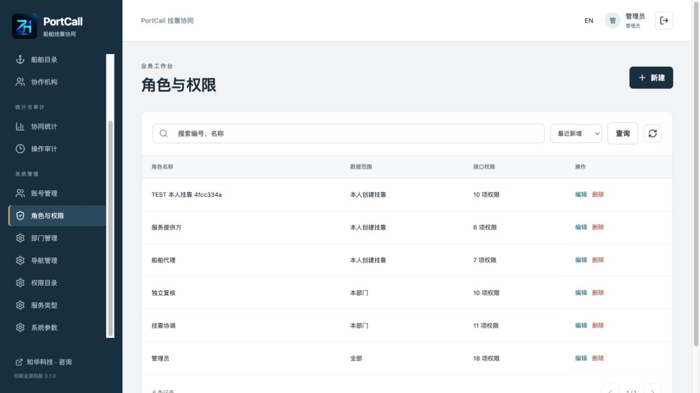
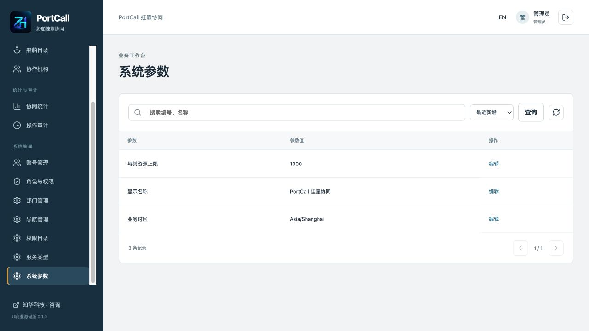

# PortCall · 知华船舶挂靠与服务协同

知华科技（上海如静知华信息科技有限公司） · [官网](https://www.zhuatech.cn/) · 微信 zhuatech / zhuatech2。

**0.1.0 · 公开源码学习版／非商业源码版。未经书面授权不得商用。** 自有代码适用 [LICENSE](LICENSE)，第三方组件及素材保留原许可，见 [THIRD_PARTY_NOTICES.md](THIRD_PARTY_NOTICES.md)。

## 一次挂靠，几套需要重新确认的时间

船代、企业挂靠协调人员和服务提供方，经常各自持有一份时间表。预计到港变更之后，原服务窗口是否还有效、谁已重新确认、实际作业有没有完成，需要逐项核对。PortCall 为单组织建立挂靠、预计时间修订、服务请求与实际作业证据台账，让参与者按自己的数据范围处理待办。

ETA／ETD 与 ATA／ATD 的时间含义参考 [IMO Just in Time Portal](https://greenvoyage2050.imo.org/pdf/just-in-time-portal/)。预计时间和窗口由人员录入，实际到离港及作业时间由授权人员根据已核实事实回报。系统不接入AIS，不生成航行建议，不提供泊位预约、港口单一窗口、海事／海关许可或法定申报。

```text
挂靠草稿 → 提交 → 独立审核 → 已规划
服务请求 → 绑定服务商确认／拒绝
时间变更提案 → 独立批准 → 计划修订增加 → 未执行服务待重排 → 新窗口 → 重新确认
实际到港 → 服务商记录开始 → 回报完成 → 独立验收／异议 → 修正回报再验收
实际离港 → 处理未结束工作 → 独立关单
```

实际离港可以先于任务闭合录入。关单要求所有服务为已验收、已拒绝或已取消；未取消的关键服务全部验收，且至少一项关键服务被验收；没有未结束计划变更。拒绝的关键服务须在离港前按实际安排另建替代，取消全部关键服务不能绕过条件。

变更批准使未执行服务进入“待重排”，保留旧窗口和确认事件；内部重排后须服务商再次确认。到港后不能批准预计时间变更。实际到港、离港、作业开始不可修改；完成报告被提出异议后可修正结束时间，旧事件保留。当前版本没有实际里程碑更正流程。

## 各岗位可以做什么

| 模块 | 已实现能力 |
| --- | --- |
| 挂靠 | 草稿增改、提交、独立批准／驳回、未到港取消、实际到离港、独立关单、版本及证据时间线 |
| 计划变更 | 当前计划版本提案、草稿修改、提交、独立审核、取消；每挂靠最多一项未结束提案 |
| 服务协同 | 草稿、发送、绑定服务商确认／拒绝、窗口重排、实际起止回报、独立验收／异议、未执行取消 |
| 船舶与机构 | 内部编号、部门、船代／服务商分类、启停和版本；未引用目录可删除，历史引用受外键保护 |
| 检索与证据 | 搜索、状态／类型筛选、分页排序、关联详情、追加事件、范围内JSON下载 |
| 工作台 | 可见挂靠和服务状态、关键待办、待重排、待验收及异议数量 |
| 管理 | 账号、5初始角色、18注册权限、14注册菜单、部门、服务类型字典、系统参数、范围审计 |
| 账号与页面 | 会话登录／退出、本人密码、实时权限、中文／英文、窄屏布局、正式LOGO、原始咨询二维码 |

协调维护目录、服务请求及实际到离港；独立复核审核挂靠和变更、验收及关单；船舶代理提报自己机构挂靠；服务提供方只确认、执行自己机构服务。审核和关单不同于相应制单账号；服务验收同时不同于制单和报告账号。内部管理员也不能代替服务商执行。

内部支持 ALL、DEPARTMENT、SELF（本人创建挂靠及关联工作）。机构绑定优先于ALL：代理只看自己的挂靠；提供方只看自己的服务及相关挂靠，看不到其他提供方服务、计划变更、内部管理。账号与机构须同部门，隐藏菜单不代替接口校验。

### 运行页面

隔离验收环境使用明确标识的TEST业务和随机测试账号，无真实客户信息。

| 登录 | 服务商工作台 |
| --- | --- |
|  |  |

| 挂靠计划与实际时间 | 服务证据 |
| --- | --- |
|  |  |

| 后台账号 | 协同统计 |
| --- | --- |
|  |  |

| 角色权限 | 系统设置 |
| --- | --- |
|  |  |

## 数据如何保存

浏览器经同源Nginx访问Spring Boot，JPA持久化至MySQL，Flyway管理版本，Hibernate只校验结构。单组织全局串行写锁、记录版本、UUID与请求内容指纹保护状态；所有变化追加事件，业务无硬删除。详见 [架构说明](docs/架构说明.md)。

| 部分 | 环境和版本 |
| --- | --- |
| 后端 | Java21、Maven3.9、Spring Boot4.0.7、Security、JPA、Flyway；MariaDB JDBC访问MySQL |
| 前端 | Vue3.5.40、Vite8.1.5、Node24.19.0、npm11、Lucide |
| 运行 | MySQL8.4、Nginx1.29、Docker Engine／Desktop、Compose v2 |
| 验收 | Python3.10+；后端测试H2 MySQL模式，完整部署另用真实MySQL |

```text
backend/                  领域、权限、API、初始化、迁移及测试
frontend/                 工作台、业务详情、管理、表单及前端测试
  public/brand/           正式LOGO、原始两张微信二维码
scripts/                  私有配置生成、真实HTTP验收、发布检查
docs/                     架构、部署、接口、操作、截图及第三方许可
compose.yaml              独立数据库、后端和前端
.env.example              配置名称；实际配置被Git和镜像忽略
```

V1建立身份和系统目录，V2建立机构、船舶、挂靠、变更、服务、命令及证据，账号增加机构绑定。外键保护关系、约束校验时间先后及版本。时间UTC保存至微秒，页面固定Asia/Shanghai，输入显式转换UTC，不依赖电脑时区。

### 启动一个空库

构建需连接公开依赖与官方镜像源。在根目录运行：

```sh
python3 scripts/init-env.py
docker compose -p portcall up -d --build --wait
```

生成器以0600建立`.env`且拒绝覆盖。默认账号 **admin**，密码从自己生成`.env`的 **ADMIN_PASSWORD** 获取，无公开固定演示密码。空库初始化总部、5角色、18权限、14菜单、4服务类型和3参数；密码BCrypt12轮散列保存。业务表为空，显式隔离验收脚本才建立TEST数据。

- 页面与同源API：[http://127.0.0.1:8128/](http://127.0.0.1:8128/)。
- 健康：[http://127.0.0.1:8128/actuator/health](http://127.0.0.1:8128/actuator/health)。
- 数据库和后端不发布宿主机端口。
- 端口覆盖：`WEB_PORT=18128 docker compose -p portcall up -d`，或修改自己`.env`。

| 变量 | 用途 |
| --- | --- |
| DATABASE_PASSWORD / MYSQL_ROOT_PASSWORD | 应用和数据库管理独立密码，无弱默认值 |
| ADMIN_PASSWORD | 仅空库初始化；至少12字符含大小写和数字，UTF-8不超过72字节；已有账号用页面修改／重置 |
| WEB_PORT / BIND_ADDRESS | 默认8128／127.0.0.1；公网部署需可信反向代理及HTTPS |
| COOKIE_SECURE | 本地HTTP为false，HTTPS为true |
| DATABASE_URL / DATABASE_USER / DATABASE_CATALOG | 后端进程覆盖JDBC、账号、库名；Compose外部数据库需自行配置环境映射 |
| TEST_URL | 验收脚本目标默认8128，只用于隔离测试环境 |

本地前端：`cd frontend && npm ci && npm run dev`，Vite5173代理后端8080。后端Java21／Maven3.9，设置DATABASE_URL（`jdbc:mariadb://127.0.0.1:13308/zhuatech_portcall`）、DATABASE_USER、DATABASE_PASSWORD、ADMIN_PASSWORD后执行 `mvn -f backend/pom.xml spring-boot:run`。开发数据库使用独立Compose卷与私有端口覆盖，见 [部署说明](docs/部署说明.md)。

升级前停止写入、备份并验证恢复，记录版本，再构建启动，由Flyway应用后续迁移。不可改写已执行迁移、删除迁移记录或数据卷解决错误。备份、独立恢复、HTTPS及诊断见部署说明。

## 验收和使用限制

```sh
mvn -B -f backend/pom.xml spotless:check test package
cd frontend
npm ci
npm run format:check
npm run lint
npm test
npm run build
cd ..
docker compose -p portcall config --quiet
git diff --check
python3 scripts/release-check.py
```

后端覆盖时间边界、HTTP/JPA状态、机构隔离、独立操作、并发变更及UUID重试；前端覆盖动作、字段、时区和CSRF。Docker Maven构建执行全部测试。全新MySQL另验证完整流程、权限、迁移、健康、重启及独立恢复：

```sh
# 仅本项目可销毁隔离库，会写TEST业务及随机账号。
python3 scripts/smoke.py --allow-test-writes
# 页面验收后保存私有当前快照，output/被忽略。
python3 scripts/smoke.py --capture
# 重启或独立恢复后逐响应比较并重新登录各岗位。
python3 scripts/smoke.py --verify
```

单类主业务上限1000，maxRecords可调100～1000；目录读取有界10000，每页最多100。单组织串行写与应用内登录限速用于学习部署，未验收大型并发、多实例、高可用、外部认证。未实现泊位冲突检测、官方船舶登记、实际里程碑更正、附件、通知、计费、进销存、多租户或外部对接。无AI／第三方账号必填配置，无模拟成功的演示模式。

会话凭证不放浏览器持久存储，写请求需CSRF，权限与停用每次核验，改密码使旧会话失效。导出继承详情范围且无宣传。生产使用HTTPS、强密码、网络隔离、最小权限、独立备份；实际`.env`、验收快照、备份及日志不可加入源码。见 [安全说明](SECURITY.md)。

| 现象 | 处理 |
| --- | --- |
| 健康失败 | 查本项目mysql／backend日志，核对配置、数据库目录、迁移，保留原卷 |
| 端口占用 | 覆盖WEB_PORT，不停止其他项目 |
| 服务无法开始 | 核对实际到港、当前计划版本、提供方绑定及确认 |
| 服务待重排 | 内部重排有效窗口后服务商重新确认 |
| 离港后不能关单 | 完成报告及验收，关闭变更，核对关键服务条件 |
| 时间被拒绝 | 核对区间、UTC转换、未来实际及起止先后 |
| 按钮不可用 | 核对角色、状态、独立人员；机构绑定优先于ALL |
| 改ADMIN_PASSWORD旧库无变化 | 变量仅初始化，使用本人密码／管理员重置 |
| 迁移校验失败 | 核对可信脚本和记录，按新版本升级，不删历史 |

## 操作、反馈与授权

日常见 [操作手册](docs/操作手册.md)，请求见 [接口说明](docs/接口说明.md)。贡献与问题反馈见 [CONTRIBUTING.md](CONTRIBUTING.md)，只提供脱敏复现；安全问题通过官网和微信私下反馈，见SECURITY.md，不在公开Issue上传凭证或客户记录。

学习源码及台账不能证明实际船位、港口放行、航行安全、服务交付或法律责任。组织须核实事实、证据和操作授权。自有代码非商业授权与第三方许可独立适用。

## 联系知华科技

本项目由知华科技（上海如静知华信息科技有限公司）提供公开源码学习版本，主要用于个人学习、技术研究与非商业交流。未经书面授权不得商用。企业信息化建设、中小企业数字化转型、中小企业 AI 转型、私有化部署、软件外包、软件项目外包、软件实施、FDE 外包、OPC 技术支持及深度定制开发，请访问知华科技官网 <https://www.zhuatech.cn/>，或添加微信 zhuatech、zhuatech2 咨询。

官网：[https://www.zhuatech.cn/](https://www.zhuatech.cn/)。商业授权、定制开发、部署与系统集成咨询微信：**zhuatech**、**zhuatech2**。

| 微信 zhuatech | 微信 zhuatech2 |
| --- | --- |
|  |  |
